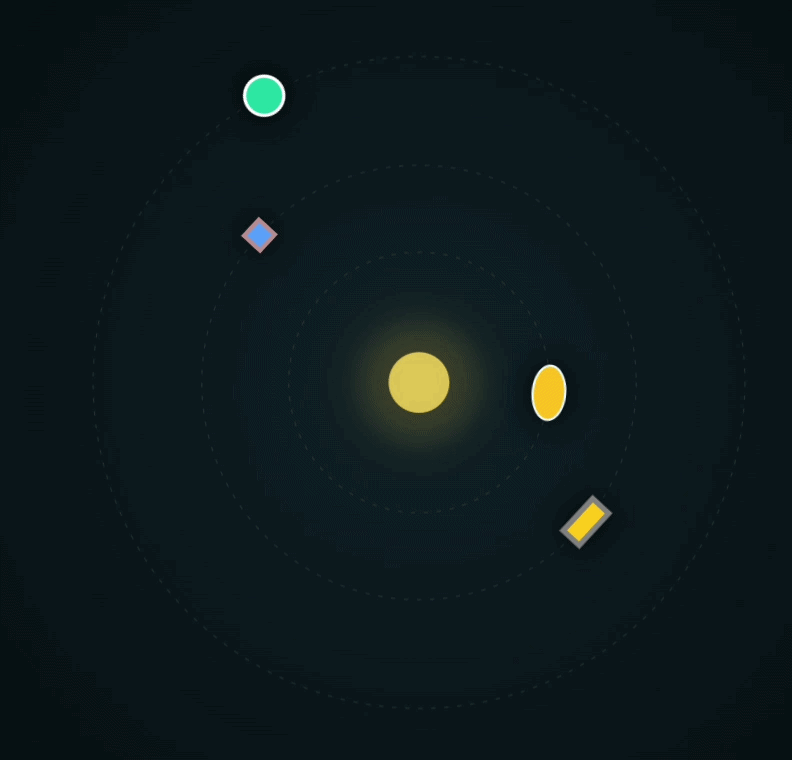

# 🌌 SVG Orbital System

Інтерактивна анімація, створена за допомогою **SVG + CSS**, яка імітує орбітальну систему з центральною "зіркою" та об'єктами, що обертаються навколо неї.

---

## 📸 Preview

<p align="center">
  
</p>

<p align="center">
  <i>Анімація орбітальної системи з використанням SVG та CSS</i>
</p>

---

## 📌 Опис проєкту

Цей проєкт демонструє можливості:
- SVG-графіки
- CSS-анімацій
- трансформацій (обертання)
- візуальних ефектів (світіння, пульсація)

У центрі знаходиться "зірка", навколо якої по різних орбітах рухаються геометричні фігури.

---

## ⚙️ Використані технології

- HTML5  
- SVG (Scalable Vector Graphics)  
- CSS3  
  - `@keyframes`
  - `transform`
  - `animation`
  - `filter (drop-shadow, blur)`
  - `radial-gradient`

---

## ✨ Функціонал

### 🌞 Центральна "зірка"
- Пульсує (анімація `pulse`)
- Складається з ядра та світлового ореолу
- Використовує градієнт для ефекту світіння

---

### 🪐 Орбіти
- 3 орбіти різного радіусу
- Стилізовані пунктирною лінією
- Реалізовані через SVG `<circle>`

---

### 🔄 Обертання

| Клас           | Швидкість | Напрямок |
|----------------|----------|----------|
| `rotateSlow`   | повільна | за годинниковою |
| `rotateMedium` | середня  | за годинниковою |
| `rotateFast`   | швидка   | проти годинникової |

---

### 🔷 Об'єкти

- 🟢 Коло — велика орбіта, світіння  
- 🟦 Квадрат — середня орбіта  
- 🔴 Еліпс — змінює колір (анімація `colorChange`)  
- 🟨 Прямокутник — додатковий елемент  

---

### 🌈 Візуальні ефекти

- `drop-shadow` — ефект світіння  
- `blur` — ореол  
- анімація кольору  
- темний градієнтний фон  

---

## 📱 Адаптивність

- SVG займає весь екран:
```css
width: 100vw;
height: 100vh;